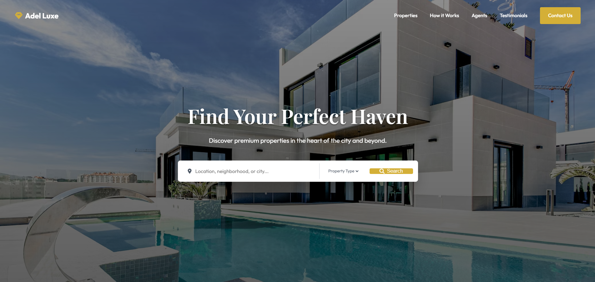

# Aura Architecture | High-End Landing Page

## Overview
Aura Architecture is a modern, premium landing page designed for architectural engineering firms. It is built with high-end aesthetics, providing a luxurious experience through minimalist design, masonry layouts, and subtle scroll animations.

## Features
- **Premium Aesthetics**: High-end typography (Playfair Display & Inter) and a clean, minimalist color palette.
- **Masonry Portfolio**: A responsive CSS-grid based masonry layout for showcasing architectural works.
- **Micro-Interactions**: Element entrance animations using `IntersectionObserver`.
- **Parallax Background**: Smooth scroll-based parallax effect for the hero section.

## Usage
Simply clone this repository and open `index.html` in your web browser. No local development server or build process is required.

## Customization
To use this as your own portfolio piece:
1. Swap the hero background and portfolio images. Each placeholder image has specific tags and IDs (e.g., `#portfolio-img-1`).
2. Update the social and contact details located in the footer in `index.html`.

## Built With
- HTML5
- CSS3 (Vanilla UI / CSS Custom Properties)
- Vanilla JavaScript
